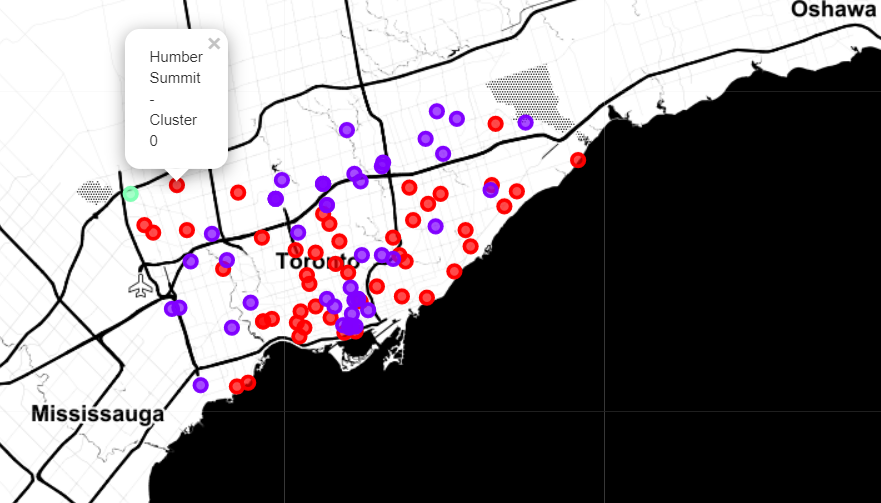

# Best Place Prediction
In this project, we will:
- Scrap the names of locations from a [Wikipedia page](https://en.wikipedia.org/wiki/List_of_postal_codes_of_Canada:_M)
- Get the cordinates of each location using Google API
- Fetch the data of top 100 venues nearby to each location using [Foursquare API](https://foursquare.com/)
- Cluster similar Data according to the frequency of people visit
- Visualize the Data

## Overview

## Note
Feel free to open an issue or a pull request for changes.  

## Data Source
- https://en.wikipedia.org/wiki/List_of_postal_codes_of_Canada:_M
- https://en.wikipedia.org/wiki/Category:Suburbs_in_Kuala_Lumpur